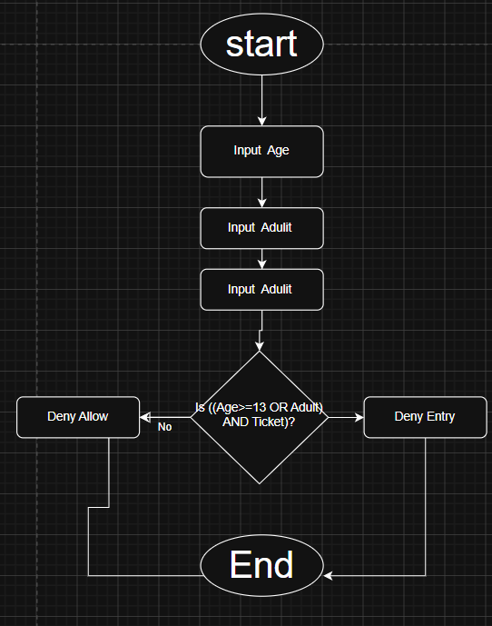

# Tutorial 2 - Movie Theater Admission System

## Scenario

A person can enter the movie theater if:

* They are 13 years old or older OR accompanied by an adult.
* They must also have a valid ticket.

---

## 1. Identify the Components

### 1.1 Inputs

* Age
* Accompanied by Adult (Yes/No)
* Valid Ticket (Yes/No)

### 1.2 Process

Check whether:
(Age >= 13 OR Accompanied by Adult) AND Valid Ticket

### 1.3 Output

* Allow Entry
* Deny Entry

---

## 2. Design the Algorithm

 
 
### Step-by-Step Solution

1. Start
2. Input age
3. Input accompanied by adult
4. Input valid ticket
5. Check if age is 13 or above OR accompanied by an adult
6. Check if ticket is valid
7. If both conditions are true, display "Allow Entry"
8. Otherwise display "Deny Entry"
9. End

---

## 3. Truth Table

| Age >=13 | Adult | Ticket | Result |
| -------- | ----- | ------ | ------ |
| F        | F     | F      | F      |
| F        | F     | T      | F      |
| F        | T     | F      | F      |
| F        | T     | T      | T      |
| T        | F     | F      | F      |
| T        | F     | T      | T      |
| T        | T     | F      | F      |
| T        | T     | T      | T      |

---

## 4. Pseudocode

START

INPUT age

INPUT adult

INPUT ticket

IF ((age >= 13) OR (adult = TRUE)) AND (ticket = TRUE)

```
DISPLAY "Allow Entry"
```

ELSE

```
DISPLAY "Deny Entry"
```

END IF

END

---

## 5. Evaluate Expression

### Test Case 1

Age = 15

Adult = No

Ticket = Yes

Result = Allow Entry

### Test Case 2

Age = 10

Adult = Yes

Ticket = Yes

Result = Allow Entry

### Test Case 3

Age = 10

Adult = No

Ticket = Yes

Result = Deny Entry

### Test Case 4

Age = 15

Adult = No

Ticket = No

Result = Deny Entry


